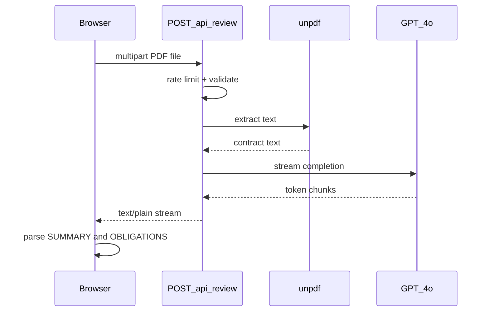

# Architecture

## Request flow



## Project structure

```
ross-ai/
├── app/
│   ├── page.tsx              # Landing page
│   ├── analyze/page.tsx      # Upload + streaming UI
│   ├── docs/                 # Fumadocs documentation
│   └── api/
│       ├── review/route.ts   # Contract analysis API
│       └── search/route.ts   # Docs search
├── components/               # Marketing + analyze UI
├── content/docs/             # MDX documentation
├── lib/
│   ├── prompts.ts            # GPT-4o system prompt
│   ├── extractPdfText.ts     # unpdf wrapper
│   └── rateLimit.ts          # In-memory rate limiter
```

## Key design decisions

### Server-side OpenAI calls

The API key lives in `process.env.OPENAI_API_KEY` on the server. The browser calls `/api/review` only — the key never reaches the client.

### Streaming responses

The API returns `text/plain` and streams GPT-4o output directly. The analyze page reads the stream and parses `[SUMMARY]` and `[OBLIGATIONS]` sections as they arrive.

### Prompt engineering

The system prompt in `lib/prompts.ts` forces a fixed output format:

```
[SUMMARY]
3-4 sentences in plain English

[OBLIGATIONS]
- [Party]: [obligation]
```

Temperature is `0.2` for consistent, factual tone.

### PDF extraction

`lib/extractPdfText.ts` uses **unpdf** — no native dependencies, safe for Vercel serverless.

### Rate limiting

`lib/rateLimit.ts` tracks requests per IP in an in-memory store. On serverless, each instance has its own store; this is acceptable for a proof-of-concept.

## Security headers

`next.config.ts` sets CSP, HSTS, `X-Frame-Options`, and related headers on all routes.

## What this does not include

- User accounts or authentication
- Persistent storage of uploaded contracts
- Legal advice or attorney-client relationship
