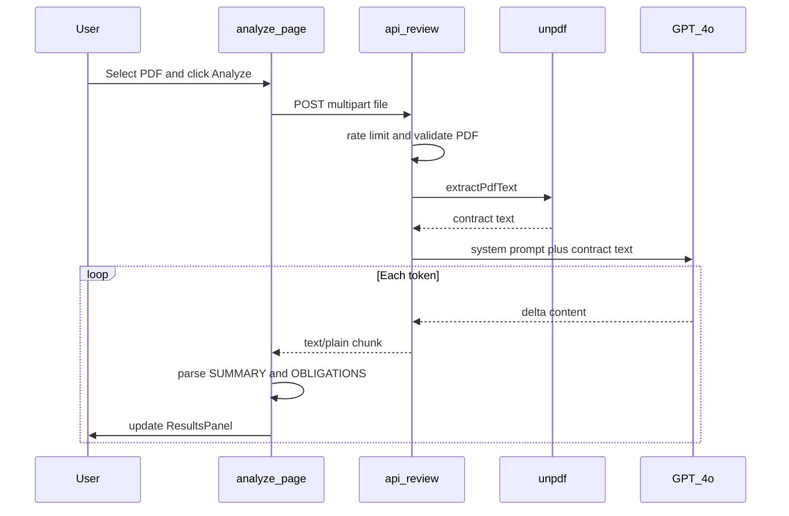

# How it works

This page explains the full AI pipeline so you can understand Ross AI without reading every source file.

## What Ross AI does (in one sentence)

**Upload a PDF → extract text → send to GPT-4o with a fixed prompt → stream plain-English `[SUMMARY]` and `[OBLIGATIONS]` back to the browser.**

There is no separate translation API. GPT reads the contract and rewrites the important parts into plain English, guided by a prompt in `lib/prompts.ts`.

## End-to-end flow



## Step 1 — Upload in the browser

**File:** `app/analyze/page.tsx`  
**UI:** `components/UploadZone.tsx`

1. The user selects a PDF (drag-and-drop or file picker).
2. Clicking **Analyze Contract** calls `handleAnalyze`.
3. The file is wrapped in `FormData` and sent with `fetch("/api/review", { method: "POST", body: formData })`.

The OpenAI API key never leaves the server. The browser only sends the PDF.

## Step 2 — Server checks (before AI)

**File:** `app/api/review/route.ts`

Before any PDF parsing or OpenAI call, the API route runs these guards:

| Check | Limit | On failure |
| --- | --- | --- |
| Rate limit | 10 requests / 15 min per IP | 429 JSON error |
| API key | `OPENAI_API_KEY` in env | 503 JSON error |
| File present | `file` in form data | 400 |
| MIME type | `application/pdf` | 400 |
| File size | 4 MB max | 400 |
| PDF magic bytes | Must start with `%PDF-` | 400 |

If any check fails, the client receives JSON `{ "error": "..." }` and shows an error modal. No streaming happens.

## Step 3 — PDF to plain text

**File:** `lib/extractPdfText.ts` (uses **unpdf**)

The PDF bytes are read in memory and passed to `extractText()` with `mergePages: true`, which concatenates text from all pages into one string.

Requirements:

- **Text-based PDF** — selectable text, not a scanned image.
- At least **100 characters** of extracted text, or the API returns 422.
- Text is **truncated to 15,000 characters** before OpenAI (`MAX_CHARS` in the route) to control cost and context size.

At this stage the text is still the original contract language — not yet summarized.

## Step 4 — Prompt engineering

**File:** `lib/prompts.ts`

GPT receives two messages:

1. **System** — `buildLegalPrompt()`: role (senior legal analyst), output format, plain English, no preamble.
2. **User** — the extracted contract text.

The model must respond in exactly this shape:

```
[SUMMARY]
3-4 sentences: parties, purpose, scope

[OBLIGATIONS]
- [Party Name]: [specific obligation]
- ...
```

OpenAI call settings (`app/api/review/route.ts`):

| Setting | Value | Purpose |
| --- | --- | --- |
| `model` | `gpt-4o` | Analysis quality |
| `stream` | `true` | Token-by-token response |
| `max_tokens` | 1500 | Cap output length |
| `temperature` | 0.2 | More factual, less creative |

## Step 5 — Streaming server to browser

**File:** `app/api/review/route.ts`

OpenAI's async stream is wrapped in a Web `ReadableStream` and returned as:

```
Content-Type: text/plain; charset=utf-8
```

Each chunk from OpenAI (`chunk.choices[0].delta.content`) is encoded and pushed to the HTTP response immediately. The connection stays open until GPT finishes.

## Step 6 — Client parses the stream

**File:** `app/analyze/page.tsx`

After a successful response (`response.ok`), the client:

1. Gets `response.body.getReader()`.
2. Decodes chunks with `TextDecoder` into a growing `accumulated` string.
3. Runs regex on every chunk:
   - `[SUMMARY]` … until `[OBLIGATIONS]` or end → `summaryText`
   - `[OBLIGATIONS]` … to end → `obligationsText`
4. Calls `setSummaryText` / `setObligationsText` so React re-renders live.

That is why words appear one after another on screen — the UI updates on each stream chunk.

## Step 7 — Display results

**File:** `components/ResultsPanel.tsx`

- **Summary** — rendered as a paragraph from `summaryText`.
- **Key Obligations** — `ObligationsList` splits lines starting with `-`, then splits `Party: obligation` on the first colon for styling.
- While streaming, a blinking cursor shows under the section still being written.
- When the stream ends, `hasResult` is set and **Analysis complete** appears.

## What gets stored?

| Data | Persisted? |
| --- | --- |
| Uploaded PDF | No — memory only for the request |
| Extracted text | No — sent to OpenAI, not saved |
| GPT output | No — streamed through to the browser |
| OpenAI API key | Server env only (`.env.local` / Vercel) |

## Key files reference

| Concern | File |
| --- | --- |
| Upload UI + stream reader | `app/analyze/page.tsx` |
| API route | `app/api/review/route.ts` |
| System prompt | `lib/prompts.ts` |
| PDF text extraction | `lib/extractPdfText.ts` |
| Rate limiting | `lib/rateLimit.ts` |
| Results UI | `components/ResultsPanel.tsx` |

## Related docs

- [Architecture](/docs/architecture) — project structure and design decisions
- [POST /api/review](/docs/api/review) — HTTP API reference
- [Errors](/docs/errors) — status codes and recovery
